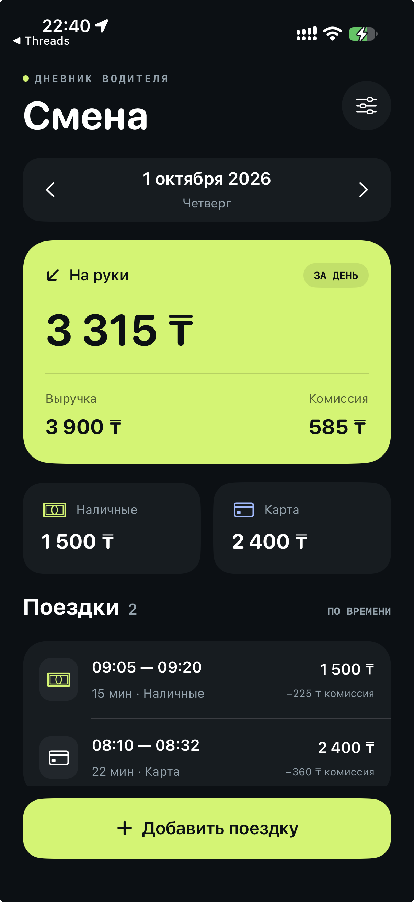
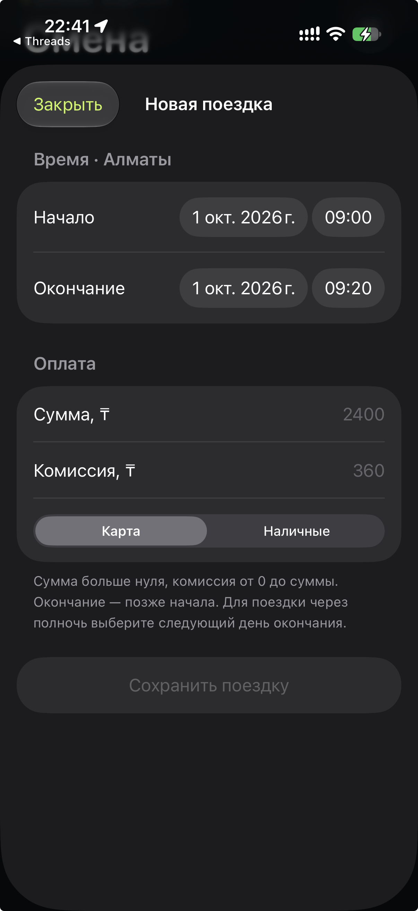

# Смена — дневник водителя

Go API и iOS-приложение на SwiftUI: поездки по дням, выручка, комиссия и доход «на руки». Сервер и приложение используют только стандартные библиотеки Go и Apple SDK.

<p>
  
  
</p>

Скриншоты сделаны на физическом iPhone. При обычном Debug-запуске приложение открывает **1 октября 2026** — день с примерами из задания. Следующий день содержит ещё три поездки. Стартовая дата настраивается.

## Быстрый запуск

Нужны Go 1.23+, macOS с Xcode 16+ и iOS 17+. Xcode-проект включён в репозиторий. XcodeGen требуется только для изменения структуры проекта.

```sh
make run
```

В другом терминале:

```sh
open ios/ShiftLog.xcodeproj
```

Выберите схему **ShiftLog**, симулятор iPhone и Run. Debug-конфигурация использует `http://localhost:8080`. `make run` при первом запуске копирует примеры в `backend/data/trips.json`, если файл отсутствует и `DATA_FILE` не задан. Существующие поездки сохраняются. Поездки можно добавлять в приложении или через API.

## Конфигурация

### Сервер

| Переменная | По умолчанию | Назначение |
|---|---|---|
| `ADDR` | `:8080` | Адрес и порт HTTP-сервера |
| `DATA_FILE` | `data/trips.json` | JSON-файл, относительно рабочей папки сервера |

```sh
ADDR=127.0.0.1:9000 DATA_FILE=/tmp/my-shifts.json make run
```

Файл создаётся при первой успешной записи. Существующий файл загружается при запуске; повреждённый JSON, невалидные поездки или повторяющиеся ID приводят к ошибке запуска. Локальные данные не попадают в Git.

В `backend/testdata/trips.json` лежат примеры за 1–2 октября 2026. Для своего пустого хранилища задайте `DATA_FILE` с новым путём: автоматическое наполнение выполняется только для стандартного запуска `make run`. Сам Go-сервер не подставляет примеры.

### iOS

Адрес можно изменить в **настройках подключения** внутри приложения — значение сохраняется на устройстве. Указывается origin без `/api`, логина, query-параметров и fragment: `https://api.example.org` или `http://192.168.1.10:8080`.

Для локальной настройки сборки:

```sh
cp ios/Config/Local.xcconfig.example ios/Config/Local.xcconfig
```

Задайте `SHIFTLOG_API_URL` и при необходимости `DEVELOPMENT_TEAM`. `SHIFTLOG_INITIAL_DATE` задаёт стартовый день в формате `YYYY-MM-DD`: Debug по умолчанию `2026-10-01`, пустое значение означает текущий день. В Release стартовый день по умолчанию текущий. Файл `Local.xcconfig` игнорируется Git. В `.xcconfig` слеши задаются через `$(SLASH)`, чтобы `//` не считалось комментарием. В Release нет предустановленного адреса: его задают конфигурацией сборки или в приложении. Сохранённый пользователем адрес имеет приоритет над настройкой сборки.

Для iPhone выберите свою команду в Signing & Capabilities. Mac и iPhone должны быть в одной сети; вместо `localhost` используйте LAN-адрес или `.local`-имя Mac и разрешите доступ к локальной сети на телефоне. Обычный HTTP разрешён только для локального подключения; удалённый сервер должен использовать HTTPS.

После изменения `ios/project.yml`:

```sh
cd ios && xcodegen generate
```

## Возможности и правила

- Выбор дня стрелками/календарём, обновление свайпом, состояния загрузки, ошибки и пустого дня.
- Сводка: количество поездок, выручка, комиссия, «на руки», наличные/карта.
- Добавление поездки с проверкой полей; повтор после сетевой ошибки сохраняет ID, данные и исходный сервер даже после перезапуска приложения.
- День определяется **началом поездки в Алматы, UTC+5**; поездка через полночь целиком относится к дню начала.
- Деньги — целые тенге, без floating-point расчётов. Сумма 1…1 000 000 000 ₸, комиссия 0…сумма, окончание строго позже начала. Оплата `cash` или `card`.
- **На руки = выручка − комиссия**. Разбивка наличные/карта показывает выручку до комиссии, не банковский баланс.

Для двух поездок из задания: 2 поездки, 3 900 ₸ выручки, 585 ₸ комиссии, **3 315 ₸ на руки**, 1 500 ₸ наличными и 2 400 ₸ картой.

## API

### `GET /api/day?date=2026-10-01`

Возвращает `date`, `timezone`, `summary` (`count`, `revenue`, `commission`, `net`, `cash`, `card`) и массив полных объектов `trips`, отсортированный от новых к старым. При одинаковом времени — по ID. Для пустого дня: нулевые суммы и `trips: []`. Некорректная дата: `400`.

### `POST /api/trips`

```sh
curl -i http://localhost:8080/api/trips \
  -H 'Content-Type: application/json' \
  -d '{"id":"my-trip-1","start":"2026-10-01T14:00:00+05:00","end":"2026-10-01T14:25:00+05:00","amount":2500,"payment":"card","commission":375}'
```

| Код | Результат |
|---|---|
| `201` | Новая поездка: `{"trip":{...},"created":true}` |
| `200` | Повтор того же ID и данных: `created:false` |
| `409` | Этот ID уже существует с другими данными |
| `400` | Неверный JSON, неизвестное поле, неверный тип, лишний объект или тело больше 16 KiB |
| `422` | Нарушение правил валидации |
| `500` | Не удалось сохранить данные; состояние в памяти не изменяется |

Ошибки API имеют вид `{"error":"описание"}`. Стандартные `404`/`405` формирует HTTP-router Go. Время принимается в RFC3339 с часовым поясом, включая дробные секунды.

**ID — ключ идемпотентности.** Клиент создаёт UUID один раз и повторяет запрос с тем же ID и полями. Два разных ID считаются двумя разными поездками. Эквивалентные моменты времени с разными UTC-смещениями не вызывают конфликт.

`GET /health` → `{"status":"ok"}`.

## Тесты

```sh
make test       # Go: race detector, coverage, vet
make test-ios   # XCTest + UI-тест с отдельным Go API
```

`test-ios` автоматически выбирает установленный симулятор iPhone. Можно указать другой:

```sh
IOS_DESTINATION='platform=iOS Simulator,name=iPhone 16' make test-ios
```

Скрипт поднимает API на `127.0.0.1:18080` с временным JSON-файлом и удаляет только этот файл после теста. Порт должен быть свободен. Рабочие поездки не затрагиваются. Результат Xcode остаётся в `build/TestResults/`.

Локально проверено 6 октября 2026: **16 Go-тестов**, `go vet`, **18 iOS unit-тестов + 1 UI-тест**, Release-сборка и запуск сервера из чистой копии — без ошибок. Покрытие `internal/diary` — **93,3%**, всего серверного модуля с учётом точки входа — 76,2%. Окружение: Go 1.27.1, Xcode 27, симулятор iOS 18.6. Минимальные версии из требований сборки отдельно не прогонялись.

Проверяются расчёты и границы данных, полный HTTP-ответ, идемпотентность и параллельные запросы, загрузка/ошибки хранилища, границы суток, сетевые ошибки клиента, восстановление неподтверждённой отправки, защита от устаревшего ответа и сценарий добавления через интерфейс. Подробности — [архитектура и тестовая стратегия](docs/architecture.md).

GitHub Actions запускает Go-проверки и **выполняет** iOS unit/UI-тесты с отдельным API, сохраняя coverage и `.xcresult`. Фактический статус CI появится после запуска workflow на GitHub.

## Архитектура и ограничения

[Описание архитектуры](docs/architecture.md)

Система рассчитана на одного водителя и один процесс сервера. JSON-хранилище выбрано по масштабу задания; блокировка обеспечивает безопасность конкурентных запросов внутри процесса, атомарная замена файла защищает от частичной записи. Для нескольких процессов нужна БД с уникальным индексом ID и транзакциями.

Нет авторизации, редактирования/удаления, полной офлайн-очереди и синхронизации пользователей. На устройстве хранится один неподтверждённый запрос. Удаление приложения удаляет и его локальные данные. Для публичного сервера потребуются HTTPS и авторизация. Часовой пояс — фиксированный UTC+5 для условий задачи, без исторических переходов.
