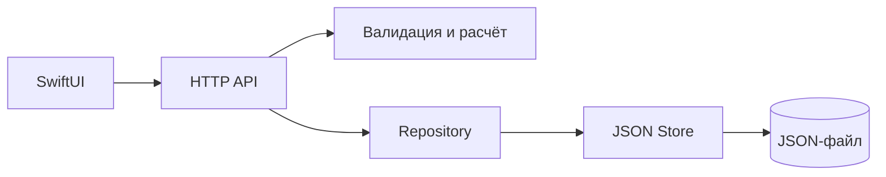

# Архитектура

## Сервер

- `cmd/server/main.go`: настройки окружения, загрузка хранилища, HTTP timeouts, завершение с ожиданием активных запросов.
- `internal/diary/domain.go`: Trip, Summary, Day, денежные ограничения, проверка данных и чистая функция расчёта. Не зависит от HTTP или файлов.
- `internal/diary/http.go`: контракт API, декодирование, ограничение размера тела и отображение ошибок в HTTP-коды. Зависит от минимального интерфейса `Repository`, а не конкретного файла.
- `internal/diary/store.go`: чтение/проверка JSON, выбор дня, сортировка, конкурентное добавление и атомарное сохранение.

Один компактный Go-пакет объединяет предметную область; файлы разделены по ответственности. Дополнительные сервисные слои для двух операций не нужны. HTTP зависит от интерфейса, поэтому ошибки хранилища можно проверять независимо.

### Запись и идемпотентность

1. Проверить поля до начала записи.
2. Под единой эксклюзивной блокировкой найти ID.
3. Те же данные: вернуть успешный повтор. Другие данные: конфликт.
4. Сформировать новую копию списка, записать во временный файл в том же каталоге, вызвать `Sync`, закрыть файл и заменить основной через `Rename`.
5. Только после успешной замены опубликовать новое состояние в памяти.

Чтение использует `RLock` и возвращает независимый срез. Блокировка действует только внутри одного процесса. Это не распределённое хранилище. Атомарный rename не является обещанием полной защиты от сбоя питания/ошибки диска; резервное копирование и гарантии файловой системы остаются за пределами задания.

## iOS

- `Models.swift`: DTO и форматирование локального дня/денег.
- `API.swift`: URLSession, HTTP-коды, JSON и RFC3339, включая дробные секунды. Сессия внедряется для сетевых тестов.
- `AppConfiguration.swift` + `Config/*.xcconfig`: адрес по конфигурации сборки, валидация и нормализация адреса. Настройки пользователя хранятся через AppStorage.
- `DiaryModel.swift`: загрузка дня, ошибки, защита от старого ответа при быстром переключении дат. UI-состояние изолировано MainActor.
- `TripSubmission.swift`: один сохраняемый неподтверждённый запрос с ID, полями и сервером назначения. UserDefaults и отправка внедряются для тестов.
- `DiaryView.swift`, `AddTripView.swift`: отображение состояния и ввод пользователя. Финансовая сводка приходит с сервера; клиент не дублирует её расчёт.

При сетевой ошибке, `409` или `5xx` запрос остаётся в локальном хранилище. Повтор использует исходный сервер даже после смены настроек. Подтверждённый успех удаляет запрос. Явные ошибки валидации `400`/`422` освобождают форму для исправления. Повреждённый сохранённый запрос не перезаписывается молча и блокирует новые отправки; отдельного интерфейса его восстановления пока нет.

## Тестовая стратегия

| Уровень | Что проверяется |
|---|---|
| Go domain | Все поля сводки, пустой день, крупные суммы, границы суммы/комиссии/ID/времени |
| Go store | Повтор и конфликт, восстановление файла, параллельные записи, ошибка записи без изменения памяти, повреждённые данные, сортировка, границы суток, независимость возвращённого среза |
| Go HTTP | Полные ответы POST/GET, точные статусы, JSON ошибок, повтор не меняет суммы, неизвестные поля/лишние JSON/лимит тела, 30 конкурентных повторов, 404/405/health |
| iOS API | URL и HTTP-метод, кодирование POST, даты API, 409 с сообщением, таймаут, повреждённый ответ, запрет неправильного адреса до сети |
| iOS state | Восстановление после таймаута, сохранение исходного ID/сервера, очистка после успеха, различие 4xx/5xx, повреждённая локальная запись, устаревший ответ дня, восстановление после ошибки |
| iOS UI + Go | Пустая смена → заполнение формы → сохранение → правильная сводка → следующий/предыдущий день → перезапуск приложения |

Race detector используется для Go. UI-тест поднимает настоящий отдельный Go API с временным файлом. Unit-тесты клиента используют URLProtocol и внедрённые зависимости, не требуют внешней сети. Это не нагрузочное тестирование; системные сбои питания, все POSIX-ошибки и все версии iOS не эмулируются.
